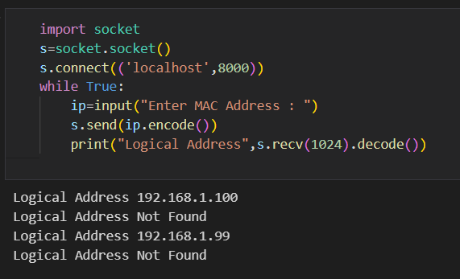

# EX-5 IMPLEMENTATION OF REVERSE ADDRESS RESOLUTION PROTOCOL ( RARP )
# DATE :06.04.2023
# AIM :
### To write a python program for simulating RARP protocols using UDP
# ALGORITHM :
# CLIENT:
### 1.Start the program
### 2.Using datagram sockets UDP function is established.
### 3.Get the MAC address to be converted into IP address.
### 4.Send this MAC address to server.
### 5.Server returns the IP address to client
# SERVER:
### 1.Start the program.
### 2.Server maintains the table in which IP and corresponding MAC addresses are stored.
### 3.Read the MAC address which is send by the client.
### 4.Map the IP address with its MAC address and return the IP address to client

# CLIENT PROGRAM :
```PY
## Developed : SOUVIK KUNDU
## Reg no : 212221230105

import socket
s=socket.socket()
s.bind(('localhost',8000))
s.listen(5)
c,addr=s.accept()
address={"6A:08:AA:C2":"192.168.1.100","8A:BC:E3:FA":"192.168.1.99"};
while True:
    ip=c.recv(1024).decode()
    try:
        c.send(address[ip].encode())
    except KeyError:
        c.send("Not Found".encode())

```
# SERVER PROGRAM :
```PY
import socket
s=socket.socket()
s.connect(('localhost',8000))
while True:
    ip=input("Enter MAC Address : ")
    s.send(ip.encode())
    print("Logical Address",s.recv(1024).decode())

```
# OUTPUT :

# RESULT:
### Thus, python program for simulating RARP protocols using UDP was successfully executed.


